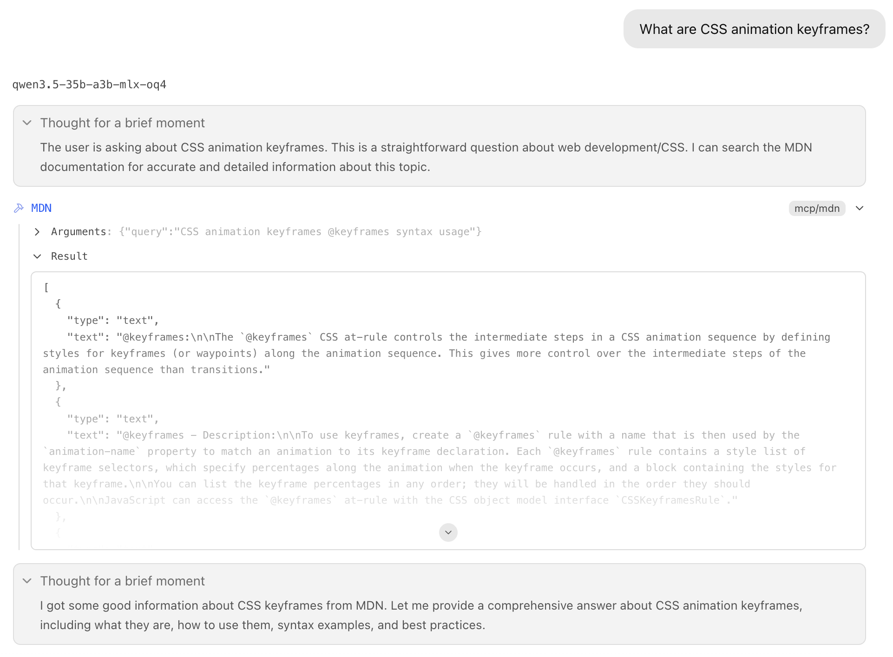

Offline-first [MDN Web Docs](https://developer.mozilla.org/) RAG-MCP server ready for semantic search with hybrid vector (1024-d) and full‑text (BM25) retrieval.

## Example



## Content

The dataset covers the core MDN documentation sections, including:

- Web API
- JavaScript
- HTML
- CSS
- SVG
- HTTP

See [dataset repo](https://huggingface.co/datasets/deepsweet/mdn) on HuggigFace for more details.

## Usage

### 1. Download dataset and embedding model

```sh
npx -y @deepsweet/mdn download
```

Both [dataset](https://huggingface.co/datasets/deepsweet/mdn) (\~260 MB) and the [embedding model GGUF file](https://huggingface.co/deepsweet/bge-m3-GGUF-Q4_K_M) (\~438 MB) will be downloaded directly from HugginFace and stored in its default cache location (typically `~/.cache/huggingface/`), just like the `hf download` command does.

### 2. Setup RAG-MCP server

```json
{
  "mcpServers": {
    "mdn": {
      "command": "npx",
      "args": [
        "@deepsweet/mdn",
        "server"
      ],
      "env": {}
    }
  }
}
```

The `stdio` server will spawn [llama.cpp](https://github.com/ggml-org/llama.cpp) under the hood, load the embedding model (~655 MB RAM/VRAM), and query the dataset – all on demand.

## Settings

| Env variable               | Default value                                                   | Description                                                                                                       |
|----------------------------|-----------------------------------------------------------------|-------------------------------------------------------------------------------------------------------------------|
| `MDN_DATASET_PATH`         | HuggingFace cache                                               | Custom dataset directory path                                                                                     |
| `MDN_DATASET_LOCALE`       | `en-us`                                                         | Dataset language, currently `en-us` only                                                                          |
| `MDN_MODEL_PATH`           | HuggingFace cache                                               | Custom model file path                                                                                            |
| `MDN_MODEL_TTL`            | `1800`                                                          | For how long llama.cpp with embedding model should be kept loaded in memory, in seconds; `0` to prevent unloading |
| `MDN_QUERY_DESCRIPTION`    | `Natural language query for hybrid vector and full-text search` | Custom search query description in case your LLM does a poor job asking the MCP tool                              |
| `MDN_SEARCH_RESULTS_LIMIT` | `3`                                                             | Total search results limit                                                                                        |

## To do

- [ ] figure out a better query description so that LLM doesn't over-generate keywords
- [ ] add more dataset [translations](https://github.com/mdn/translated-content/tree/main/files/)
- [ ] automatically update and upload the dataset artifacts monthly with GitHub Actions

## License

The RAG-MCP server itself and the processing scripts are available under MIT.
